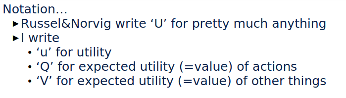

# Reinforcement Learning

The general idea of reinforcement learning comes down to the fact that we don't
know exactly what the agent should do, but we do know when it has done something
right. While we don't know _how_ to win a chess game, we do know the goal is to
win. Therefore, **Reinforcement Learning (RL)** concerns itself with learning
based on **rewards**.

- We will specifically consider 3 designs:

  1. A **utility-base** agent that learns a utility function based on the
     states and from there behaves to maximize its utility. ==This
     seems similar to the utility of a state from the MDP chapter.==

  2. A **Q-Learning** agent that learns an **action-utility**, or
     **Q-function**, giving the expected utility of taking an action in a
     certain state.

  3. A **reflex agent** that learns a policy that maps directly from states to
     actions. ==In MDPs from the previous chapter this was the first introduced
     technique I think==

- Generally, there are two variants: **passive** learning, where a policy is
  fixed and an agent learns the utilities of the states; and **active** where is
  learns the utilities as well as the policy.

- In all cases, the primary problem is for the agent to **explore** as much of
  the domain. The agent needs to have had an adequate number of experiences to
  take sufficiently informed actions. That is, an agent should refrain from
  **beunen**.

{#fig:very_import}

- There is also a distinction to be made between **model-free** and
  **model-based** reinforcement learning.
  - **Model-free** learning captures learning methods which do not take into
    account the underlying transition and reward functions, $P$ and $R$ resp, of
    the underlying MDP.
  - **Model-based** RL attempts to populate these functions with learned values
    or distributions.

## Model-Free Reinforcement Learning

### Passive Learning

- The most simple example is that of a passive, model-free agent in a
  state-based representation where are the environment is fully observable.
- The policy is fixed, so we will determine the utility of the policy.
- The big difference being a lack of a **transition model**, $P(s' \bar s,a)$,
  and **reward function**, $R(s)$.

- The first method is **direct utility estimation** (aka **Monte Carlo
  prediction**) which basically boils down to executing the policy many times
  starting from a new state each time. From this, we get an expected reward that
  represents the utiltiy of the state.
- It is **unbiased**, meaning it will converge to the right solution, but has
  high **variance**, meaning it will take a lot of samples to get there.
- A problem with this is that is doesn't take into account that the utility of
  the current state is dependent on that of the previous according to the
  bellman equation.

- An alternative is to use **temporal-difference** learning which expresses the
  utility of the 'current' state into that in a difference between it and
  successive states. Formally, it uses the following relation to update the
  utility of the current state, given the current policy.

  $$
  U^\pi(s) \leftarrow U^\pi(s) + \alpha(R(s) + \gamma U^\pi(s') - U^\pi(s))
  $${#eq:td_update}

  Here, $\alpha$ is the **learning rate**.
- It could be considered a form of **stochastic gradient descent (SGD)**, but
  not quite. ==Not exactly sure why not quite. It's not very clear from the
  slides.==
- It's important to note that this method is **biased** due to
  **bootstrapping**, but has **lower variance** than the previous method. The
  **bootstrapping** comes from the assumption in @eq:td_update that this holds
  even for non-final $U^\pi(s)$.

### Active Learning

- We know how to learn $U^\pi$, but we really want to know how to learn $U^*$.
  Therefore, we have to learn a policy.

- A very simple approach would be to adapt @eq:td_update to use $U(s, a)$
  instead:

  $$
  U^\pi(s, a) \leftarrow U^\pi(s, a) + \alpha(R(s, a) + \gamma \max_{a'} U^\pi(s', a') -
  U^\pi(s, a))
  $${#eq:q_update}

  The expected utility of a state-action pair is also often denoted as $Q$.
  Therefore, this approach is also called **Q-Learning**. Note that we are
  taking $a'$ with that returns the maximum utility.

- **State-action-reward-state-action (SARSA)** is an alternative to the prior
  where we don't take the max action. We then essentially determine the expected
  utility of a policy. We can then try to optimize such that $\pi \rightarrow \pi^*$.

### Scaling Up

- Up until now, we have solely worked in a state-action based system which is
  essentially represented by a lookup table. Performing the previous algorithms
  on large state-spaces, however, quickly becomes impractical.

- An alternative to such a tabular approach would be **function approximation**.
  That is, use any sort of function to approximate the model. One such example
  would be to use a neural network.

- It's not 'true' gradient descent so only a few of the nice properties
  associated with it remain (at least for linear functions):
  - TD learning: **converges** to bounded approximation.
  - SARSA: might **chatter** (cycle around the optimal solution) but not diverge.
  - Q-learning: can **diverge**.

- The last property can be attributed to the **deadly triad of RL**:
  1. bootstrapping,
  2. off-policy learning, and
  3. function approximation

### Policy Search

- **Policy search** is very simple: just keep changing the policy until it
  improves, then stop. An example would be the following:

  $$
  \pi(s)=\operatorname*{max}_{a}Q_{\theta}(s,a)
  $$

  The idea is then that policy search would adjust the parameters, $\theta$,
  such that the policy improves.

- The policy could be improved by determining the **policy gradient** from the
  **policy value** and applying a hill-climbing algorithm.

- This could be combined with a value function that evaluates the current
  policy, in something called an **actor-critic method**. This reduces high
  variance otherwise associated with policy gradient methods.

## Model-Based Reinforcement Learning
